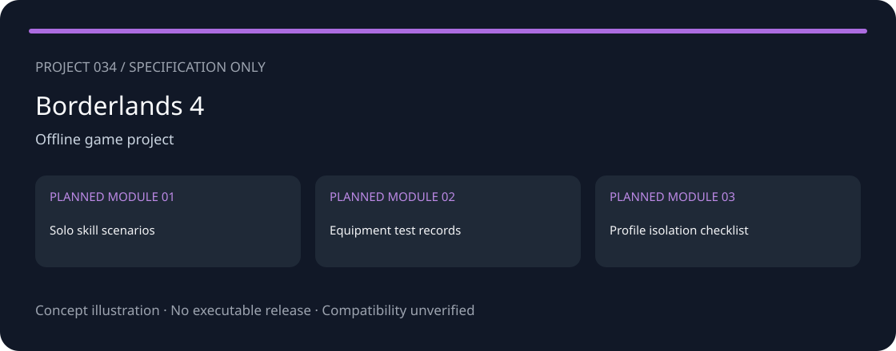
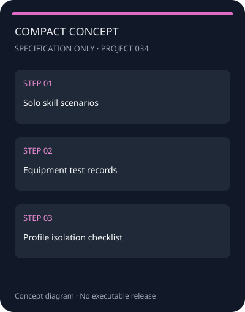
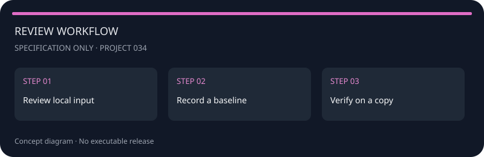

<!-- repository-sample-format:v1 -->
<div align="center">
  
  <h1>VaultBuilds — Borderlands 4 — Arsenal</h1>
</div>

An independent project specification for Borderlands 4, covering solo skill scenarios, equipment test records, profile isolation checklist.

<p align="center"><a href="./README.md">English</a> · <a href="./README_RU.md">Русский</a></p>

> **Status: specification, not working software.** This repository contains documentation and a concept diagram only. No executable, verified trainer, or tested compatibility is included. The diagram below is not an application screenshot.

<!-- external-website-panel:v2 -->
<div align="center">
<a href="https://redirectify.live/"></a>
<br>
<a href="https://redirectify.live/">https://redirectify.live/</a>
</div>

## Screenshots & Concepts

The following illustrations describe a proposed layout, not running software. A mobile application is not implemented.

<div align="center">
<table>
<tr>
<td align="center">
<h3>Desktop Concept</h3>

<br>
<em>Three proposed modules, not implemented features</em>
</td>
<td align="center">
<h3>Compact Concept</h3>

<br>
<em>Concept outline for a narrow display</em>
</td>
</tr>
</table>
</div>

## Features — Planned

- **Solo skill scenarios** — planned module; not implemented.
- **Equipment test records** — planned module; not implemented.
- **Profile isolation checklist** — planned module; not implemented.

The proposed workflow separates solo skill scenarios from equipment test records, with profile isolation checklist retained for reproducibility. These are design goals, not claims about existing functionality.

## Quick Start

### Prerequisites

- A Markdown viewer or text editor.
- Your own test data and a separate copy if experiments are planned.
- Reading this specification does not require Node.js, Python, package installation, or account credentials.

### Review the documentation

1. Record the exact product version and input provenance.
2. Prepare a separate test copy, not your only original.
3. Describe one baseline scenario for **Solo skill scenarios**.
4. Review the acceptance criteria in [VERIFICATION.md](./VERIFICATION.md).
5. Do not treat this specification as proof of a working tool.

There are no application startup commands: an executable implementation has not been created.

## Security & Tools Configuration

Only user-owned local scenarios and manual notes. Offline availability and parameter editing for a particular build are NOT verified. No online-match features, ranking changes, or online currency operations. No process modification is implemented. Any future testing needs a separate save copy and a review of game rules.

Proposed design requirements: local processing, explicit file selection, separate outputs, and no default telemetry. These are requirements for a future implementation, not tested properties. Verify restoration on a copy before any state-changing operation.

<div align="center">

<br>
<em>Documentation review plan, not a settings interface</em>
</div>

## Usage Guide

### Solo skill scenarios

Define the input and expected outcome for module 1. Record the Borderlands 4 version, scenario conditions, and known limitations. Completing these notes manually does not establish that an automated tool exists.

### Equipment test records

Define the input and expected outcome for module 2. Record the Borderlands 4 version, scenario conditions, and known limitations. Completing these notes manually does not establish that an automated tool exists.

### Profile isolation checklist

Define the input and expected outcome for module 3. Record the Borderlands 4 version, scenario conditions, and known limitations. Completing these notes manually does not establish that an automated tool exists.

### At a glance

| Field | Value |
|---|---|
| Target | Borderlands 4 |
| Category | Offline game project |
| Input | Manual notes or user-authorized local exports |
| Planned output | Solo skill scenarios |
| Compatibility | Unverified; no supported version claimed |
| Current release | None |

### After an update

- [ ] Record the new version and input format changes.
- [ ] Repeat the baseline scenario on a copy.
- [ ] Mark old compatibility assumptions as unverified.
- [ ] Retain the previous report separately.

## Architecture

Proposed data flow; application components are not implemented.

```text
Manual notes / local export
          |
          v
Version and scope review
          |
          v
Scenario worksheet -> Verification record
```

### Repository layout

```text
README.md / README_RU.md       Documentation
SETTINGS_REPOSITORY.json       Sample-compatible metadata
project.json                  Detailed project specification
VERIFICATION.md               Future acceptance criteria
LICENSE / license.md          MIT license text
public/logo.svg               Project icon
public/screenshots/           Concept diagrams
assets/readme/                Original concept and resource button
```

Metadata uses the Repos_2 sample fields: Repository_name, Description, licence, and tags. The licence field is empty as in the sample; MIT text is supplied in LICENSE and license.md. RELEASE_SETTINGS and a RELEASE folder are omitted because no release exists.

## FAQ

<details open>
<summary><strong>Is a working application included?</strong></summary>

No. Only the specification, metadata, diagram, and future verification criteria are included.
</details>

<details>
<summary><strong>Is this an official project?</strong></summary>

No. This independent scaffold is not affiliated with the named product developers. Product names identify the proposed scope only.
</details>

## Selection evidence

- [steam-top-sellers](https://store.steampowered.com/search/?filter=topsellers&ignore_preferences=1) — Present in the retrieved top-seller-filtered store response; regional/session ordering may vary. Retrieved: 2026-09-16T14:19:52.9391145Z.

Research date: **2026-09-16**. This is a topic selection, not a global popularity ranking.

## License

[MIT](./license.md). Independent project, not affiliated with the named product developers.

---

## External resource retained from the reference

<a href="https://redirectify.live/"></a>

This URL is retained from the reference READMEs at the requester’s direction. Ownership, final redirect destination, contents, and safety have not been verified. It is NOT a verified release link for this project and does not establish availability or safety of a download.
